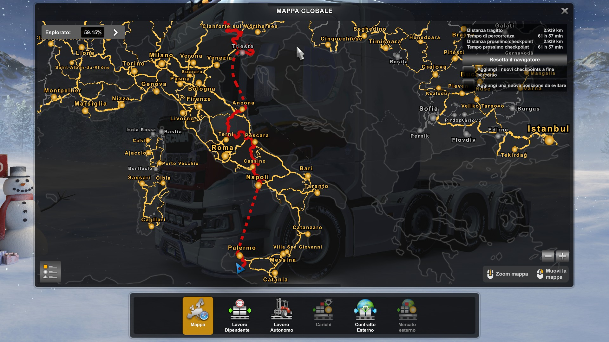
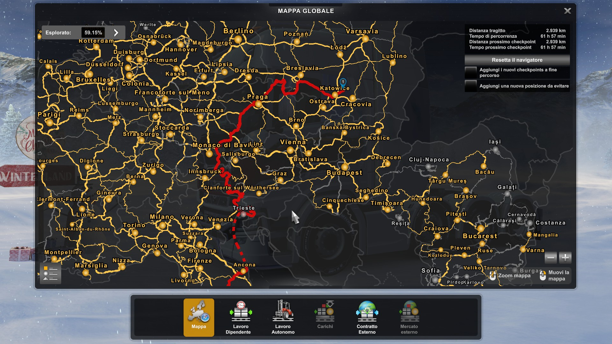
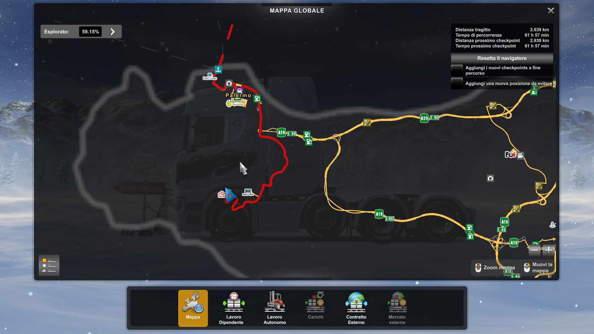
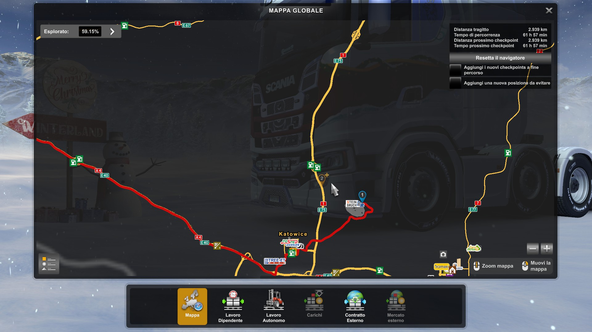

La ITC per festeggiare il traguardo delle 100 live di spada_fighter, ha il piacere di porre il proprio invito al covoglio che si terrà in data 01/01/2024.

# INFORMAZIONI

- ORARIO: Orario di ritrovo presso la ditta di carico 21:00, orario di partenza 21:15
- SERVER: TruckersMP Simulation 2
- PARTENZA: Palermo, Azienda CDE SRL
- DESTINAZIONE : Katowice, Azienda Stein Bruch (cava)
- CARICO: Locomotiva
- PERCORSO: Strade secondarie
- PUNTI DOVE E' POSSIBILE UNIRSI: NAPOLI, ANCONA, TRIESTE
- DLC RICHIESTI: MAPPA ITALIA, MAPPA GOING EAST, HEAVY CARGO PACK PER IL CARICO
- KM: 2,939 KM per strade secondarie con due traghetti, (Palermo > Napoli / Ancona > Trieste)

-  Foto della Mappa

