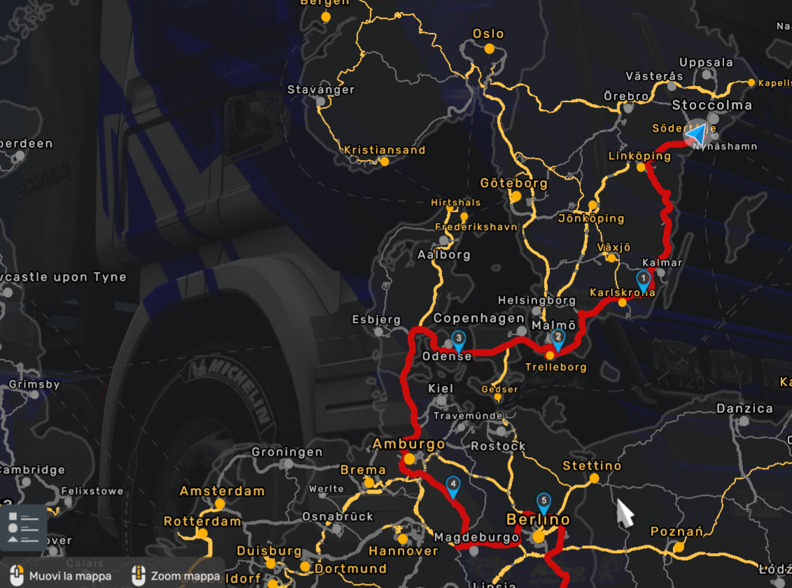
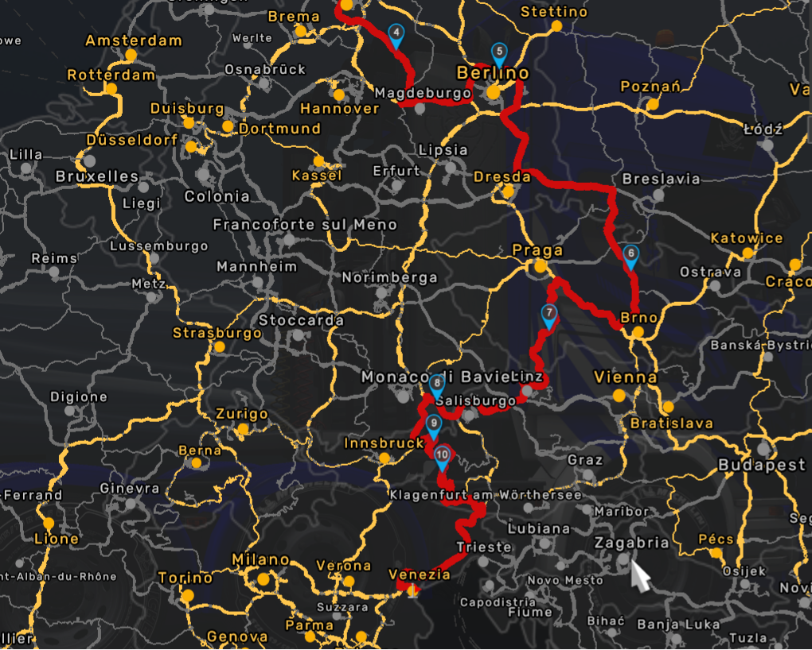
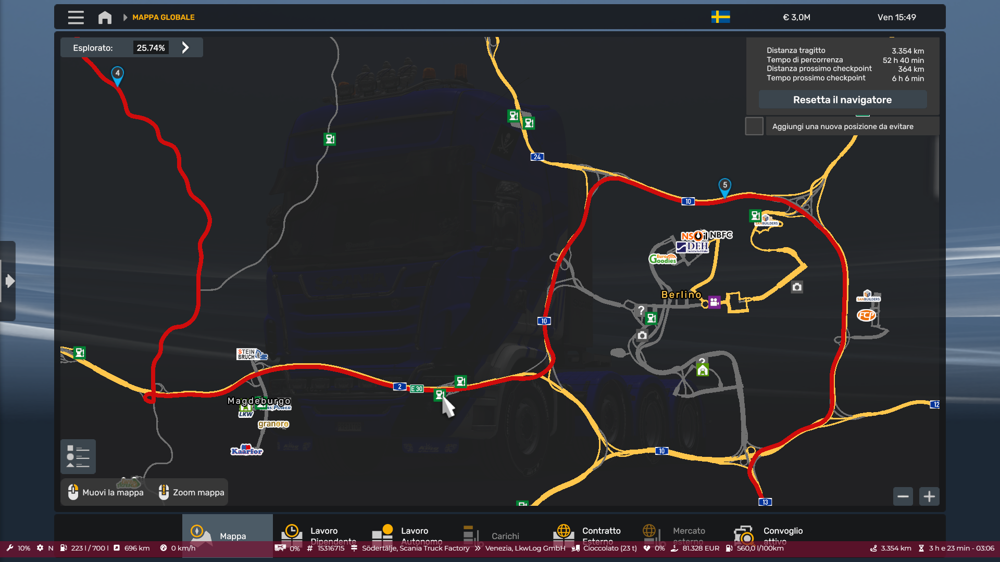

<!-- truncate -->

# CONVOGLIO DI NATALE

Ciao, speriamo che questo viaggio organizzato dalla Italian Truck Company sia l'inizio di un buon Natale, dopo gli eventi passati abbiamo deciso di creare un nuovo evento natalizio e come sempre allargarlo a tutte le aziende virtuali (VTC).

Come punto di partenza abbiamo scelto la sede Scania, la quale si trova presso la Città di: Södertälje.
"Ricercare l'azienda con il nome di: Scania Truck Factory"
(Il punto di partenza si trova nel DLC Scandinavia)

La consegna dovrà essere effettuata presso la LKW azienda situata a Venezia
(Il punto di consegna non richiede nessun DLC)

Per il seguente viaggio abbiamo deciso di effettuare 2 soste da 5 minuti in due aree di servizio di cui una nei pressi di un'officina per effettuare eventuali riparazioni. Nel caso effettuaste soste non programmate vi preghiamo di accodarvi al convoglio.

- Giorno 22/12/2024
- Orario di incontro: 20:30 UTC
- Orario di partenza: 21:00 UTC
- Luogo di partenza: Södertälje
- Azienda: Scania Truck Factory
- Carico: Cioccolato
- Destinazione: Venezia
- Azienda: LKW

# REGOLE CONVOGLIO & INFO
- Discird: https://discord.com/invite/9vCpUQpXrC
- MP Ufficiale SCS id: 85568392932940505/101 (avviare il gioco in single player e poi ricercare il convoglio)
- STAFF EVENTO Bitpredator & Heardexvil
- È vietato impersonare lo staff dell'evento
- È necessario seguire le istruzioni dello staff
- È obbligatorio parcheggiare in posti idonei senza recare problemi di circolazione
- I partecipanti al convoglio devono lasciare il luogo di partenza in modo ordinato (uno alla volta).
- La pubblicità è vietata.
- I partecipanti devono trainare un rimorchio.
- Sono vietati i rimorchi doppi, i rimorchi tripli, i rimorchi HCT e le configurazioni per trasporto pesante.
- Sono vietati tutti i veicoli opzionali (mod)
- È vietato sorpassare.
- Il roaming libero sul server è vietato. (viaggiare esternamente al convoglio) 
- Verranno applicate tutte le regole di buona condotta tra persone e il rispetto del codice stradale.
- L'ordine di uscita sarà scritto in chat di gioco, vi preghiamo di rispettarlo (usciranno prima le VTC)

# BUONE FESTE DALLA ITC #