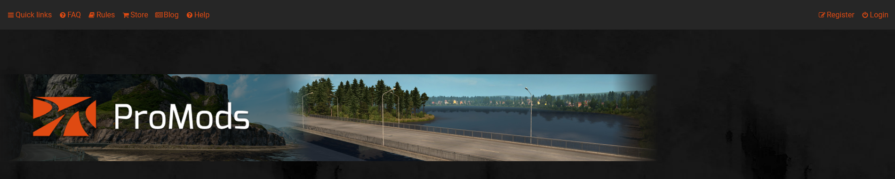
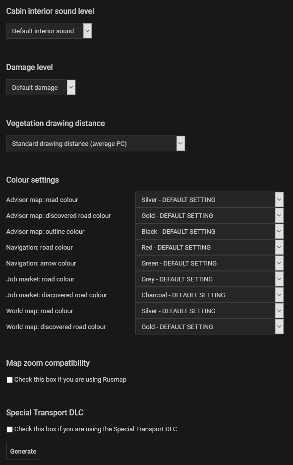
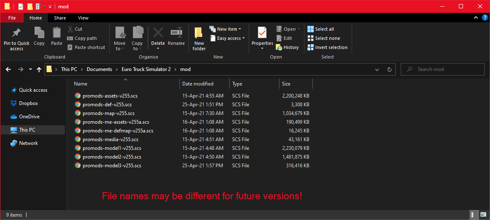
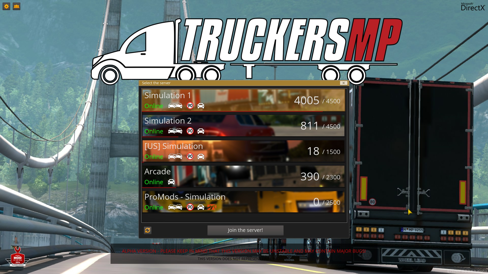

# Installazione
- La seguente è una guida passo passo su come installare l'espansione della mappa "Promods Europe, The Great Steppe e Middle East" per Euro Truck Simulator 2.

**IMPORTANTE**
- Per utilizzare la Promods devi possedere tutti i DLC elencati qui: https://promods.net/compat.php?game=ets
- Inoltre, i carichi di World Of Trucks potrebbero non funzionare correttamente in ProMods.

# Step 1
- Dirigiti sul sito https://www.promods.net e crea un profilo o accedi al tuo profilo se già lo possiedi.

# Step 2
- Vai su https://www.promods.net/setup.php?game=ets
- Ti verrà chiesto di selezionare una lingua, seguito dalla creazione di un file “def”. Non tutte le opzioni nel file di definizione verranno usate nel multiplayer (TruckersMP).

# Step 3
- Seleziona l'opzione che preferisci per scaricare ProMods Europe. L'opzione a pagamento (veloce) ti farà scaricare la mod completa in un archivio ad una velocità maggiore rispetto all'opzione gratuita (lenta). Se scegli l'opzione lenta, dovrai scaricare tutti i file uno per volta.

Assicurati di estrarre i file scaricati. Puoi trovare maggiori informazioni su come fare qui: https://promods.net/viewtopic.php?f=2&t=3852 

# Step 4
- Una volta che hai tutti i file di ProMods sul tuo sistema, vai nella cartella mod, nella tua directory di Euro Truck Simulator 2 e sposta tutti i file in questa cartella. La cartella con i dati di gioco si trova solitamente in Documenti a meno che tu non abbia specificato altro nelle opzioni di avvio.

Nota che non devi mettere i file nella cartella mod di TruckersMP. Devi scegliere la cartella mod della directory di Euro Truck Simulator 2, ad esempio: C:\Users\utente\Documents\Euro Truck Simulator 2\mod.

NON cambiare il nome di alcun file di ProMods, altrimenti non verranno riconosciuti dal launcher di TruckersMP.

Tieni a mente che TruckersMP ha un suo manager delle mod e, per questo, non vedrai ProMods nel Mod Manager in gioco.

# Step 5
Avvia il launcher di TruckersMP, seleziona l'opzione di avviare Euro Truck Simulator 2 e unisciti a un server con l'icona di ProMods. Per favore nota che ci potrebbe volere un po' di tempo per superare la schermata di caricamento. Euro Truck Simulator 2 ti mostrerà un avvertimento di "Rilevate mod mancanti". Devi cliccare su “Carica comunque” e ProMods si avvierà correttamente.

Se scegli un server ProMods, ma ricevi comunque un errore, dovrai leggere questo errore e sistemarlo. Nel caso tu non sia in grado di correggere l'errore, sentiti libero di chiedere aiuto su discord: https://discord.gg/yzPxXhdF6D

Per favore ricorda che la ridistribuzione dei file di ProMods non è permessa! Questa è pirateria di software è un crimine.
