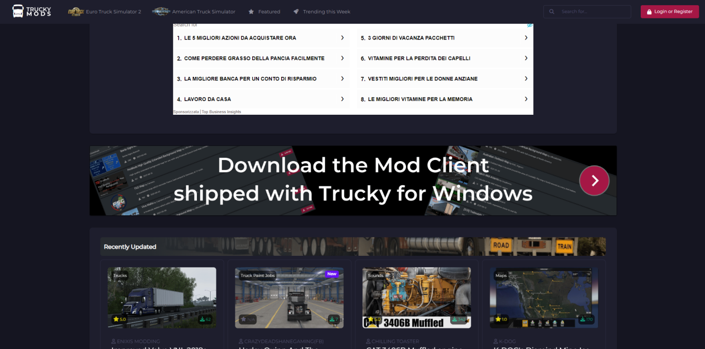

# Installazione Trucky

1) Per iniziare l'installazione di Trucky è necessario recarsi, sul sito ufficiale: https://truckyapp.com/, cliccare su truckymods.io

2) Una volta fatto questo, bisognerà creare un’account, loggarsi sul sito ed infine cliccare su "Download the Mod Client shipped with Trucky For Windows", successivamente cliccare su Download Now.

3) Dopo di che cliccare su Download  Trucky for Windows, scaricare il client e seguire la procedura guidata per una corretta installazione

4) Una volta scaricato ed installato il client, impostare la lingua in italiano e accedere con il proprio account Steam.
